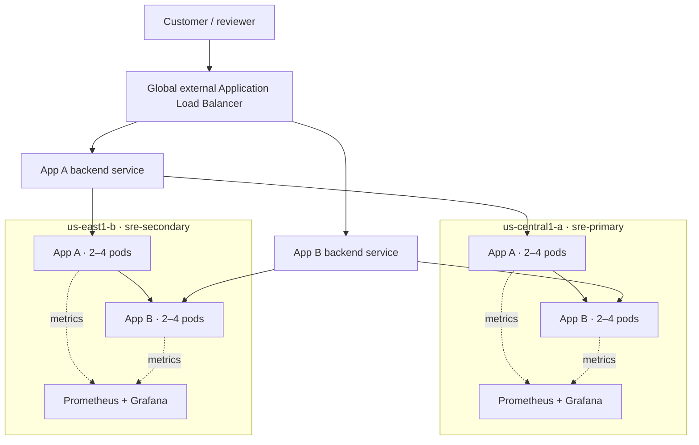
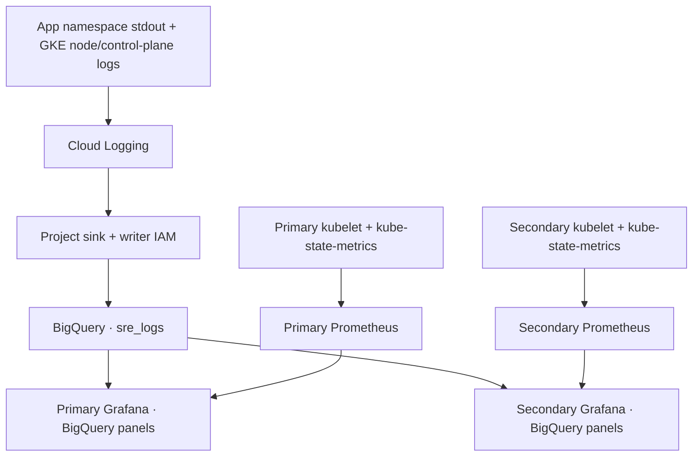

# Architecture and rationale

## Traffic path

1. Client resolves an optional hostname, or uses the global IPv4 address directly.
2. The Google frontend terminates TLS when configured and applies URL routing.
3. App-specific backend service selects a healthy NEG endpoint in either region using health, capacity and locality. This is not a guarantee of geographically closest routing on every request.
4. With container-native NEGs the frontend connects directly to Pod IP:8080. There is no NGINX ingress hop and no NodePort data-plane hop.
5. For `/api/summary`, App A calls the local App B ClusterIP Service with a two-second timeout.
6. Applications emit request logs and Prometheus metrics. A→B request identifiers support log correlation; they are not distributed trace spans.

## Decisions

| Decision | Reason and consequence |
|---|---|
| Two zonal Standard clusters | Lower footprint and explicit node-pool control. Each regional deployment remains vulnerable to its selected zone; production uses regional clusters/multiple node zones. |
| Private nodes, restricted public API | NAT supplies outbound access; only the operator CIDR can use the Kubernetes API. Cloud Shell's public egress can change, requiring a Terraform update. |
| Standalone NEGs and Terraform global edge | Demonstrates multi-region load balancing without fleet/MCI. Services own NEGs; Terraform owns the edge. Teardown ordering is mandatory. |
| Dedicated ranges per region | Avoid overlapping Pod/Service CIDRs and leave a clear expansion path. Global external Application LB does not require a customer proxy-only subnet. |
| Private Google Access | Appropriate Google API access from nodes without public IPs. Private Service Access is a separate producer-network connection used by services such as private Cloud SQL; it is not needed for this stateless demo. |
| One role-configured image | Two independent Deployments/Services and failure domains, with a small audited common codebase. They are deliberately simple demo applications, not separate product implementations. |
| Prometheus + Grafana in each cluster | No cross-cluster Prometheus exposure or paid SaaS dependency. Resource panels are local; BigQuery log panels are project-wide. Ephemeral retention is acceptable for a short demo. |
| App credentials omitted | Apps do not access GCP services and receive no IAM grants or Kubernetes API token. Grafana has a distinct Workload Identity with read/query-only BigQuery access. |
| Explicit optional enterprise controls | Avoid claiming compliance or capabilities that are absent. See requirement matrix. |

IAM uses additive member grants, not authoritative project policies. Optional team grants accept real principals; no fake groups are created. GKE RBAC still needs deliberate binding for any supplied human role. CI validates source without cloud credentials and does not apply Terraform.

Initial footprint: one `e2-standard-2` node per cluster, autoscaling to three; two replicas per app (eight application Pods total), plus monitoring/system Pods. The monitoring stack can cause a second node to be needed. A replica count does not guarantee node diversity; spread constraints are best effort when only one node exists.

## Production extensions (not claimed as delivered)

Regional clusters, stronger per-team namespace RBAC, organization policies, protected remote state, workload image signing/attestations, Cloud Armor, Secret Manager CSI, persistent monitoring storage or managed metrics, service-level alert routing, OpenTelemetry spans, Cloud Profiler and Error Reporting integration, stateful backup/restore tests and a formal DR runbook.
